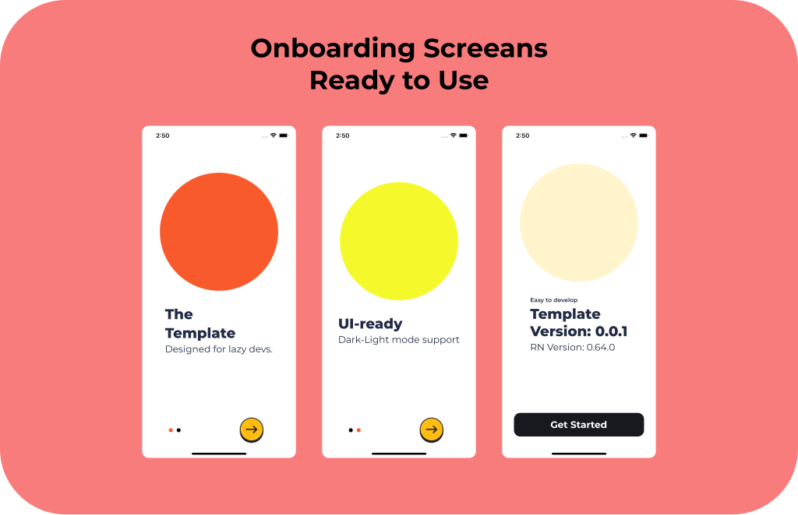
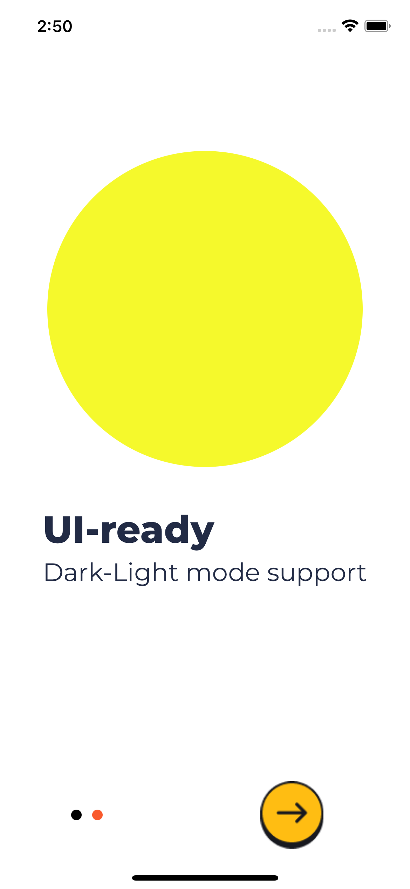
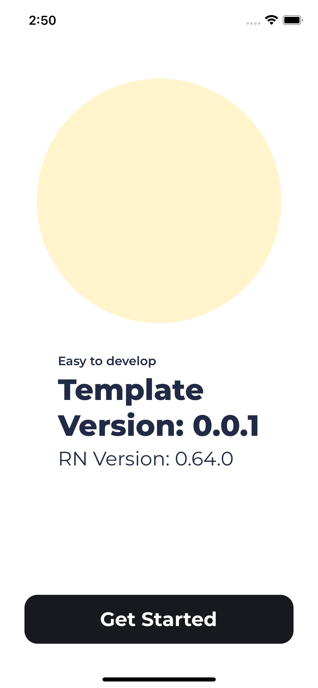

# Light RN Template

#### Designed for smart (lazy) developers

 

## Navigation

1. Onboard (3 Screens)
2. Main
   - Home
   - About
   - Content

## Showcase

## Tech

- React Native
- Typescript

## Navigation

- React-Navigation 5.9+

## UI and Theme

- @eva-design
- @ui-kitten/eva-icons
- react-native-responsive-screen

## Splash Screen

- react-native-bootsplash

### Store

- Redux
- Redux-Saga
- Redux-Toolkit
- Redux-Persist
- Async-Storage by Community

### Linting and Formating

- Eslint
- Prettier
- EditorConfig

## Others

- react-native-gesture-handler
- react-native-reanimated
- react-native-safe-area-context
- react-native-svg
- react-native-clean-project
