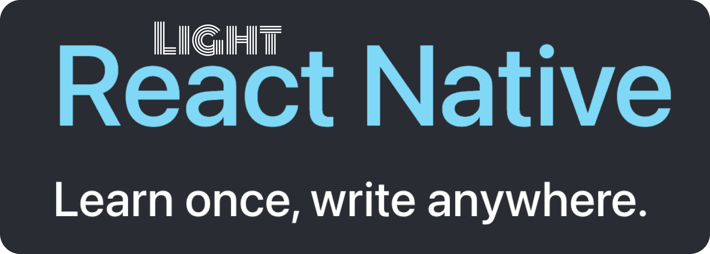

 

# Light RN Template

#### Designed for smart (lazy) developers

 

## Navigation

1. Onboard (3 Screens)
2. Main
   - Home
   - About
   - Content

## Showcase

# Onboarding Screens

# Unit Testing

- Jest is ready to use
- Mockups are ready too

## Tech

- React Native
- Typescript

## Navigation

- React-Navigation 5.9+

## UI and Theme

- @eva-design
- @ui-kitten/eva-icons
- react-native-responsive-screen

## Splash Screen

- react-native-bootsplash

### Store

- Redux
- Redux-Saga
- Redux-Toolkit
- Redux-Persist
- Async-Storage by Community

### Linting and Formating

- Eslint
- Prettier
- EditorConfig

## Others

- react-native-gesture-handler
- react-native-reanimated
- react-native-safe-area-context
- react-native-svg
- react-native-clean-project

## Contributors ✨

<!-- ALL-CONTRIBUTORS-LIST:START - Do not remove or modify this section -->

<table>
  <tr>
    <td align="center"><a href="https://joeygoksu.com"> <b>Joey Goksu</b></a> 
    <a href="https://joeygoksu.com/aboutme" title="About me">📖</a>
    </td>
</table>

<!-- ALL-CONTRIBUTORS-LIST:END -->
